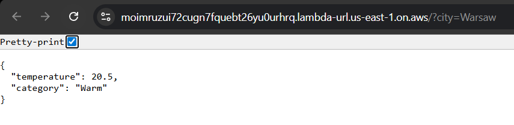
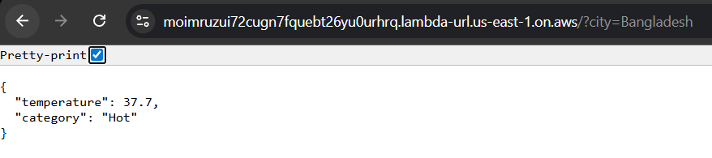
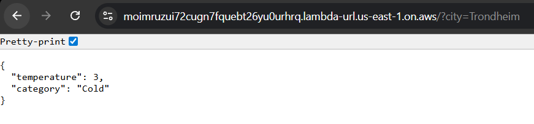

# Weather Temperature Service

## About the project

This project is a backend service that retrieves the current temperature for a given city and classifies it into a temperature category.

The application is deployed as an AWS Lambda function and exposed via an HTTP endpoint (Function URL).

---

## Application flow

The application follows a layered architecture:

```
Handler → Service → Provider → Geocoding → Classifier
```

* **Handler** – entry point (AWS Lambda), responsible for request handling and orchestration
* **Service** – contains business logic and coordinates components
* **Provider** – retrieves weather data from an external API
* **Geocoding Service** – converts a city name into geographic coordinates
* **Classifier** – determines temperature category

---

## Used APIs

* **Geocoding**: Google Geocoding API
  Used to convert city names into latitude and longitude.

  https://developers.google.com/maps/documentation/geocoding/guides-v3/requests-geocoding

* **Weather data**: Open-Meteo API
  Used to retrieve current temperature based on coordinates.

  https://open-meteo.com/

---

## Temperature classification

The temperature is categorized based on the following rules:

| Temperature (°C) | Category |
| ---------------- | -------- |
| < 0              | Freezing |
| 0–10             | Cold     |
| 10–20            | Mild     |
| 20–30            | Warm     |
| > 30             | Hot      |

---

## Design decisions

* **Separation of concerns**
  Business logic is clearly separated from external API communication and from the Lambda handler.

* **Extensibility via abstraction**
  A `WeatherProvider` interface allows easy replacement or addition of new weather providers.

* **External API isolation**
  API-specific DTOs are separated from internal models to reduce coupling.

* **Minimal DTO mapping**
  Only required fields from external APIs are mapped, improving resilience to API changes.

* **Constructor-based dependency injection**
  Dependencies are passed explicitly, making the code easier to test and maintain.

* **Configuration via environment variables**
  API keys are not hardcoded and are retrieved from environment variables.

---

## Unit testing approach

The application is designed to be testable without calling real external APIs.

This can be achieved by:

* mocking the `WeatherProvider` interface
* mocking the `CityGeocodingService`
* testing `WeatherService` independently

Example:

* provide a mock `WeatherProvider` that returns a fixed temperature
* verify classification logic
* verify returned response structure

---

## HTTP Endpoint

The Lambda is exposed via a Function URL.

### Example request

```
GET https://moimruzui72cugn7fquebt26yu0urhrq.lambda-url.us-east-1.on.aws/?city=Warsaw
```

### Example response

```json
{
  "temperature": 20.5,
  "category": "Warm"
}
```

### Query parameter

* `city` — name of the city

---

## Example results

Different cities return different classifications:





---

## Documentation

The `doc/` directory contains:

* AWS Lambda creation confirmation
* Sample Lambda test execution results
* Example requests and responses

---

## Design reflection

The current design uses abstraction (`WeatherProvider`) to decouple the application from a specific weather API.

This makes it easy to extend the system with additional providers without modifying business logic.

If extended further, the system could include:

* caching for geocoding results
* retry logic for external API calls
* improved error handling and validation
* a dependency injection framework for scalability

---
